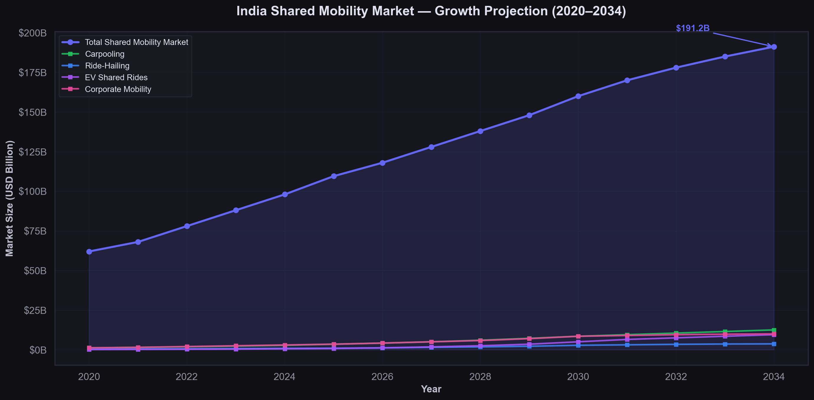

# Real-Time-Market-Research-and-Trend-Analysis-Go-To-Go-Cars
A real-time market research and trend analysis project for Go To Go Cars using Python, Pandas, Matplotlib, and Seaborn. The project analyzes India's shared mobility industry, competitor landscape, market growth, and customer trends through interactive visualizations and business insights.
#  Real-Time Market Research & Trend Analysis – Go To Go Cars

A comprehensive market research and competitive analysis project focused on the **Indian Shared Mobility Industry**, developed for **Go To Go Cars**. This project leverages **Python**, **Pandas**, **Matplotlib**, and **Seaborn** to analyze market trends, competitor performance, customer demographics, and business opportunities through data-driven visualizations.

---

##  Project Overview

The shared mobility industry in India is experiencing rapid growth due to increasing urbanization, digital adoption, and demand for affordable transportation. This project provides actionable business insights by analyzing market trends, competitor performance, customer preferences, and industry growth to support strategic decision-making for **Go To Go Cars**.

---

##  Objectives

- Analyze India's shared mobility market.
- Compare major competitors in the industry.
- Study customer demographics and behavior.
- Identify market trends and growth opportunities.
- Visualize business insights using interactive charts.
- Support strategic business decisions through data analysis.

---

## Tools & Technologies

- Python
- Pandas
- Matplotlib
- Seaborn
- Jupyter Notebook
- CSV Dataset

---

##  Project Structure

```
Real-Time-Market-Research-and-Trend-Analysis-Go-To-Go-Cars
│
├── dataset/
├── images/
├── notebooks/
├── README.md
├── requirements.txt
└── LICENSE
```

---

# Dashboard Preview

## Complete Business Intelligence Dashboard


---

#  Visualizations

## 1. Market Growth Projection



---

## 2. Revenue Comparison


---

## 3. User Growth Trajectory


---

## 4. Feature Comparison Radar Chart


---

## 5. Feature Heatmap


---

## 6. Customer Demographics Analysis


---

## 7. City Coverage Analysis


---

## 8. Customer Sentiment Analysis


---

## 9. SWOT Impact Analysis


---

## 10. Market Segment CAGR Analysis


---

## 11. Funding Comparison


---

## 12. Correlation Matrix


---

#  Key Insights

- India's shared mobility industry is projected to grow significantly over the next decade.
- Competitor benchmarking highlights opportunities for Go To Go Cars to strengthen its market position.
- Customer demographics reveal key target segments for business expansion.
- Revenue trends demonstrate strong growth potential within the shared mobility ecosystem.
- SWOT analysis identifies strategic opportunities and potential risks.
- City-wise coverage analysis highlights regions with the highest market potential.
- Customer sentiment provides valuable insights into user preferences and service quality.
- Correlation analysis uncovers relationships between major business variables.

---

#  Business Impact

This project demonstrates how data analytics can support:

- Market Research
- Competitive Intelligence
- Business Strategy
- Customer Insights
- Data Visualization
- Decision Making

---

#  Future Enhancements

- Interactive Power BI Dashboard
- Real-time API Integration
- Machine Learning Forecasting
- Geographic Market Mapping
- Automated Dashboard Updates

---

# How to Run

1. Clone this repository

```bash
git clone https://github.com/YourUsername/Real-Time-Market-Research-and-Trend-Analysis-Go-To-Go-Cars.git
```

2. Install dependencies

```bash
pip install -r requirements.txt
```

3. Open the notebook

```bash
jupyter notebook
```

4. Run all cells.

---

#  License

This project is intended for educational and portfolio purposes.

---

# Author

**Vemula Subhash**

 Email: vemulasubhash90@gmail.com

LinkedIn:
https://www.linkedin.com/in/vemula-subhash-78aa7b217
GitHub:
https://github.com/Subhash07-07

---

If you found this project helpful, consider giving it a **Star** on GitHub.
